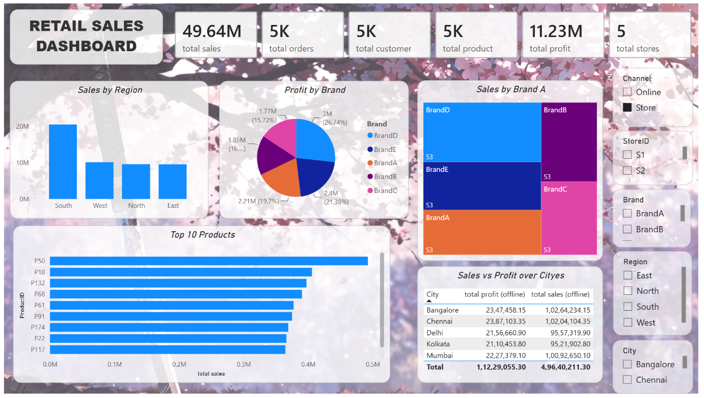
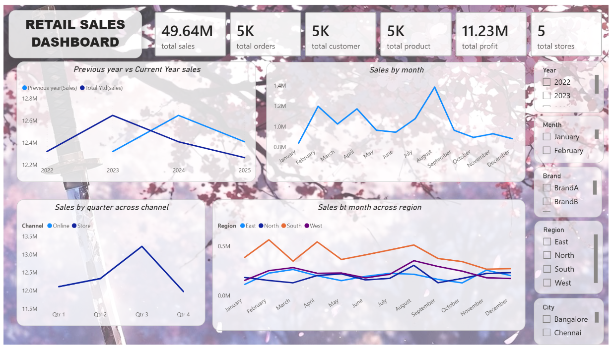

# retail-sales-profitability-analytics-powerbi
📊 Retail Sales &amp; Profitability Data Analytics | Power BI Dashboard | Sales, Profit, Orders, Products, Categories, Stores &amp; Regional Performance | Interactive Business Insights 🚀

# 📊 Retail Sales & Profitability Data Analytics Dashboard | Power BI

📊 A fully developed **Retail Sales & Profitability Data Analytics Dashboard built entirely using Microsoft Power BI**.

The dashboard provides an interactive analysis of **sales, profit, orders, customers, products, brands, stores, regions, cities, and sales channels**, helping identify business trends and performance drivers.

---

## 📸 Dashboard Preview





---

## 📌 Project Overview

This project was **fully developed using Microsoft Power BI** to transform retail sales data into an interactive business analytics dashboard.

The complete workflow was performed within Power BI, including:

* 🧹 Data Cleaning
* 🔄 Data Transformation
* 🗂️ Data Modeling
* 🧮 DAX Calculations
* 📊 Data Visualization
* 🎛️ Interactive Filters & Slicers
* 📈 Business Performance Analysis

The dashboard allows users to explore retail performance across different business dimensions and gain actionable insights from the data.

---

## 🔄 Power BI Development Workflow

```text
Raw Retail Data
       ↓
Power Query
       ↓
Data Cleaning & Transformation
       ↓
Data Modeling
       ↓
DAX Measures & Calculations
       ↓
Interactive Visualizations
       ↓
Power BI Dashboard
       ↓
Business Insights
```

---

# 📊 Dashboard Pages

## Page 1 — Sales & Profitability Overview

Provides a comprehensive overview of retail business performance.

### 📌 KPIs

* 💰 Total Sales
* 💵 Total Profit
* 🛒 Total Orders
* 👥 Total Customers
* 📦 Total Products
* 🏪 Total Stores

### 📈 Visual Analysis

* 🌍 Sales by Region
* 🏷️ Profit by Brand
* 🏆 Top 10 Products by Sales
* 📊 Sales by Brand
* 🏙️ Sales vs Profit by City
* 🛍️ Sales by Channel

### 🎛️ Interactive Filters

* Brand
* Region
* City
* Store
* Sales Channel

---

## Page 2 — Sales Trend Analysis

Focuses on understanding sales performance and trends over time.

### 📈 Analysis

* Previous Year vs Current Year Sales
* Monthly Sales Trend
* Quarterly Sales by Channel
* Monthly Sales by Region
* Year-wise Sales Analysis
* Month-wise Sales Analysis

### 🎛️ Interactive Filters

* Year
* Month
* Brand
* Region
* City

---

# 📌 Key KPIs

| KPI                |      Value |
| ------------------ | ---------: |
| 💰 Total Sales     | **49.64M** |
| 💵 Total Profit    | **11.23M** |
| 🛒 Total Orders    |     **5K** |
| 👥 Total Customers |     **5K** |
| 📦 Total Products  |     **5K** |
| 🏪 Total Stores    |      **5** |

> KPI values represent the dashboard's default/selected filter state and may change when filters are applied.

---

# 🎯 Business Questions

The dashboard helps answer:

* What are the total sales and profit?
* Which region generates the highest sales?
* Which brands contribute the most profit?
* Which products generate the highest sales?
* How do online and store sales compare?
* Which cities generate higher sales and profit?
* How do sales change month by month?
* How does sales performance vary across quarters?
* How does current-year sales compare with previous-year sales?
* Which regions perform better during different months?
* Which stores, brands, and regions contribute most to overall performance?

---

# 🔍 Key Observations

Based on the dashboard:

* 💰 Total Sales: **49.64M**
* 💵 Total Profit: **11.23M**
* 🛒 Total Orders: **5K**
* 👥 Total Customers: **5K**
* 📦 Total Products: **5K**
* 🏪 Total Stores: **5**
* 🌍 The **South region** records the highest sales among the regions displayed.
* 🏷️ Brand-level profitability is compared using percentage-based analysis.
* 🏆 Top-performing products are identified through the Top 10 Products analysis.
* 🛍️ Sales performance is compared across different sales channels.
* 📈 Sales trends are analyzed across months, quarters, years, regions, and channels.

---

# 🛠️ Power BI Technologies Used

### Microsoft Power BI

* 📊 Power BI Desktop
* 🔄 Power Query
* 🧮 DAX
* 🗂️ Data Modeling
* 📈 Data Visualization
* 🎛️ Slicers & Filters
* 📌 KPI Cards
* 📊 Interactive Charts
* 📅 Time-Based Analysis

### Data Analytics Skills

* Sales Analysis
* Profitability Analysis
* Product Analysis
* Brand Analysis
* Regional Analysis
* Store Analysis
* Customer Analysis
* Channel Analysis
* Trend Analysis
* Business Intelligence

---

# 📂 Repository Contents

| File                           | Description                  |
| -----------------------------  | ---------------------------- |
| `Retail_Sales_Multi_year.pbix` | 📊 Complete Power BI project |
| `dashboard-image.pdf`          | 🖼️ Dashboard preview        |
| `README.md`                    | 📄 Project documentation     |

---

# 🚀 How to Use

1. Download the `.pbix` file from this repository.
2. Open it using **Microsoft Power BI Desktop**.
3. Navigate through the dashboard pages.
4. Use the slicers and filters to interact with the report.
5. Select different years, months, brands, regions, cities, stores, and channels.
6. Analyze KPIs and visualizations to identify business trends.

> ⚠️ The interactive dashboard requires **Microsoft Power BI Desktop**. GitHub only provides the project files and preview images.

---

# 💡 Project Outcome

This project demonstrates a complete **Power BI-based Data Analytics workflow**, from data preparation and transformation to data modeling, DAX calculations, visualization, and business insights.

The final dashboard provides an interactive way to monitor **retail sales and profitability performance** and supports data-driven decision-making.

---

# 👨‍💻 Author

## Sanjai R

🎓 Data Analytics Student
📊 Aspiring Data Analyst

